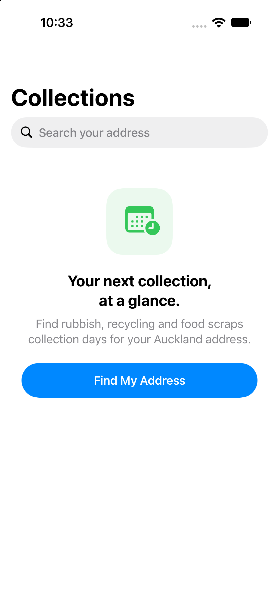
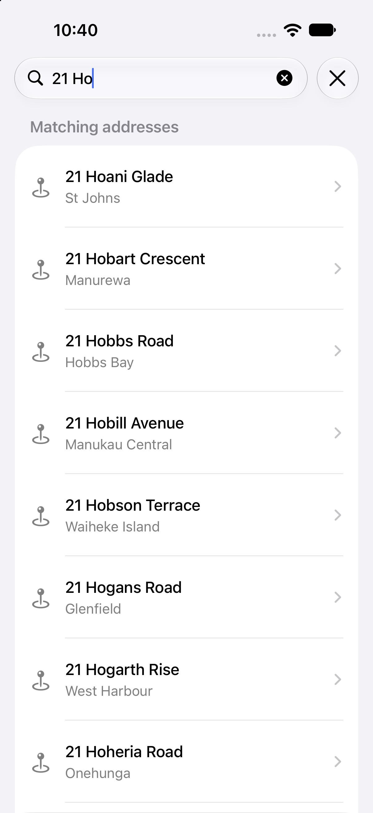
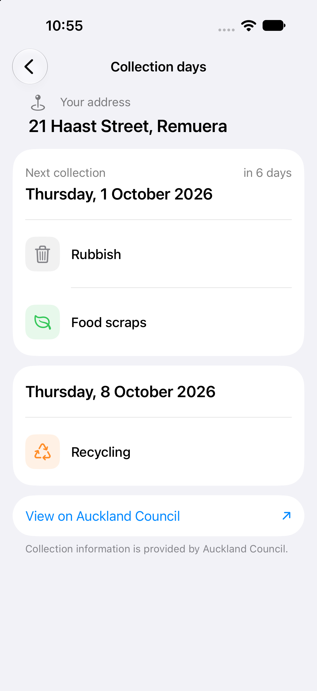

#  Auckland Garbage Collection

Auckland Garbage Collection is an iOS app that helps Auckland residents find their next rubbish, recycling, and food scraps collection days. Search for an address, choose the matching property, and see its upcoming collections together in one place.

The app is built with SwiftUI and uses a separate [Firebase Functions backend](https://github.com/lancy98/auckland-garbage-backend) to retrieve collection information from Auckland Council. This is an independent project, not an official Auckland Council app.

## Screenshots

| Find your address | Address results | Collection days |
| :---: | :---: | :---: |
|  |  |  |

## Features

- Search Auckland addresses and select a matching property.
- See the next rubbish, recycling, and food scraps dates, grouped by collection day.
- Refresh collection dates and open the property page on Auckland Council's website.
- Native iOS search, navigation, loading states, and support for dark mode and larger text.

## Tech Stack

- Swift and SwiftUI
- Observation framework with `@Observable` view models
- Firebase Functions for callable backend requests
- Firebase App Check with App Attest on devices and the debug provider in the iOS simulator
- Xcode string catalogs for localized UI text
- iOS 18.0+

## Project Structure

```text
Auckland Garbage Collection/
├── Auckland Garbage Collection.xcodeproj/
├── Auckland Garbage Collection/
│   ├── Presentation Layer/       # SwiftUI screens and view models
│   ├── Domain Layer/             # Models, use cases, and repository protocols
│   ├── Data Layer/               # Firebase Functions repositories
│   ├── Assets.xcassets/
│   └── Localizable.xcstrings
└── Screenshots/
```

## Architecture

The app separates its SwiftUI screens, domain models and use cases, and Firebase repositories. Views own their observable view models with `@State`. An address search returns a property ID; selecting it calls `getAucklandBinDates` and shows the returned dates. The project uses Main Actor default isolation.

The backend lives in the separate [auckland-garbage-backend repository](https://github.com/lancy98/auckland-garbage-backend). It exposes the `searchProperty` and `getAucklandBinDates` callable functions. Both require Firebase App Check and check the calling Firebase App ID.

## Getting Started

### Requirements

- Xcode with an iOS 18 or newer simulator; the project has been verified with Xcode 27
- A Firebase project with an iOS app registered as `com.lancy.AucklandGarbageCollection`
- [Firebase CLI](https://firebase.google.com/docs/cli) and Node.js 24 to run the local backend

### Configure Firebase

1. Download the iOS app's `GoogleService-Info.plist` from Firebase Console.
2. Place it at `Auckland Garbage Collection/GoogleService-Info.plist`. This file is ignored by Git.
3. If you use your own Firebase project, update the allowed Firebase App ID in the backend's `functions/src/appCheck.ts` and configure App Check for the iOS app.

### Run with the local backend

1. Clone and set up the [backend repository](https://github.com/lancy98/auckland-garbage-backend) using its README.
2. From the backend repository root, start the Functions emulator:

   ```sh
   firebase emulators:start --only functions --project auckland-garbage-collection
   ```

   Use your Firebase project ID in place of `auckland-garbage-collection` if it differs. The Functions emulator must be available on port `5001`.

3. Open `Auckland Garbage Collection.xcodeproj` in Xcode, select the **Auckland Garbage Collection** scheme and an iOS simulator, then run the app with `Cmd + R`.

Debug simulator builds call the local Functions emulator at `localhost:5001` and use the App Check debug provider. Builds on physical devices use App Attest and the configured Firebase backend. See the backend README for App Check setup and deployment details.

## Data Source

Collection information comes from [Auckland Council's rubbish and recycling collection days service](https://experience.aucklandcouncil.govt.nz/rubbish-recycling-collection-days.html). Dates depend on that service being available and its response format remaining compatible with the backend.
